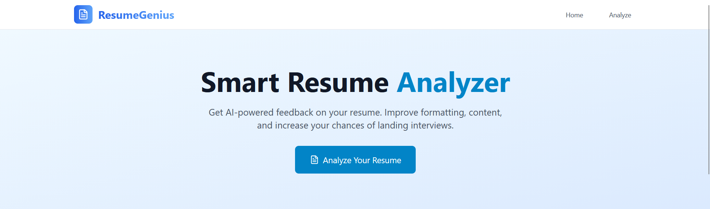
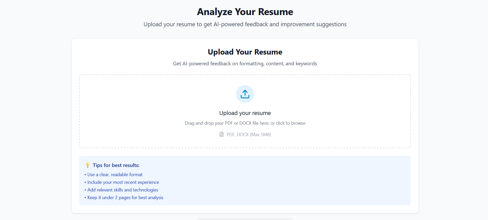
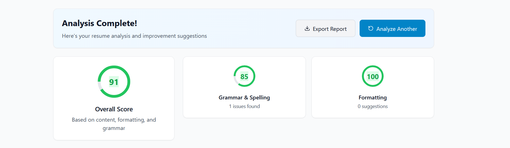
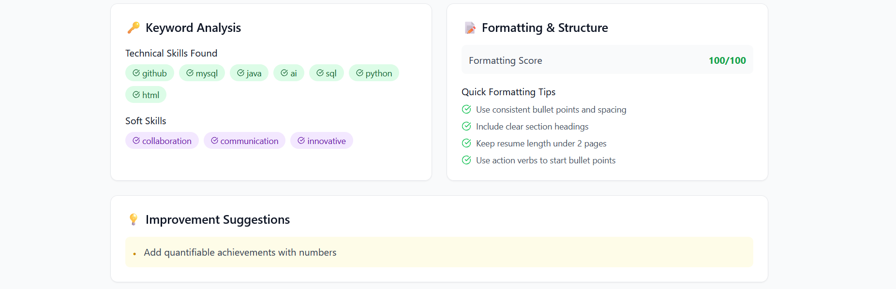
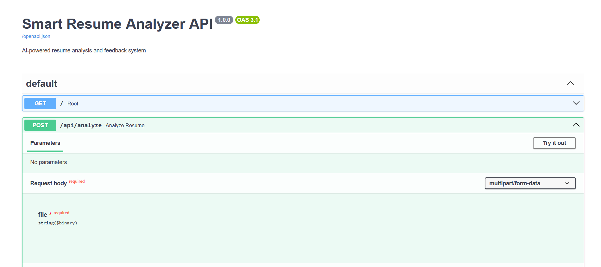

# 🚀 Smart Resume Analyzer


An AI-powered web application that analyzes resumes and provides actionable feedback on formatting, content, keywords, and overall quality. Get instant AI-powered insights to improve your resume and increase your chances of landing interviews.

## ✨ Features

- 📄 **Multi-format Support** - Upload PDF and DOCX resumes with drag & drop interface
- 🤖 **AI-Powered Analysis** - Get intelligent feedback using advanced NLP and parsing
- 📊 **Detailed Scoring** - Overall score with section-wise breakdown (Grammar, Formatting, Content)
- 🔑 **Keyword Analysis** - Identify missing and present technical skills
- 💡 **Actionable Suggestions** - Specific, practical improvement recommendations
- 🎨 **Modern UI** - Clean, responsive design with Tailwind CSS
- ⚡ **Real-time Processing** - Fast analysis with progress indicators

## 🎯 Demo



*Live demo: [Add your deployment link here]*

## 🛠️ Tech Stack

**Frontend:**
- ⚛️ React 18 + Vite
- 🎨 Tailwind CSS
- 🔄 Axios for API calls
- 📦 Lucide React icons
- 🚀 React Router DOM

**Backend:**
- 🐍 FastAPI (Python)
- 📄 PyMuPDF (PDF parsing)
- 📝 python-docx (DOCX parsing)
- 🔤 spaCy (NLP processing)
- 🌐 Uvicorn (ASGI server)

## 📸 Screenshots

### Analysis Results

*Detailed analysis with scores and suggestions*

### Keyword Analysis

*Technical skills and missing keywords display*

## 🚀 Quick Start

### Prerequisites
- Node.js 18+ 
- Python 3.9+
- Git

### Installation

1. **Clone the repository**
   ```bash
   git clone https://github.com/PolihronisVarvaris/smart-resume-analyzer.git
   cd smart-resume-analyzer

Backend Setup

cd backend/venv

# Create virtual environment
python -m venv venv

# Activate virtual environment
# Windows:
venv\Scripts\activate
# Mac/Linux:
source venv/bin/activate

# Install dependencies
pip install -r requirements.txt

# Start backend server
uvicorn main:app --reload --host 0.0.0.0 --port 8000

Frontend Setup (in a new terminal)

cd frontend

# Install dependencies
npm install

# Start development server
npm run dev

Access the Application

    Frontend: http://localhost:3000

    Backend API: http://localhost:8000

    API Documentation: http://localhost:8000/docs

Usage

    Upload Your Resume

        Navigate to the Analyze page

        Drag and drop your PDF or DOCX file

        Or click to browse and select your resume

    View Analysis Results

        Get an overall score (0-100)

        See detailed breakdown by category

    Implement Suggestions

        Add missing technical skills

        Improve formatting based on recommendations

        Enhance content with action verbs

        Optimize for ATS systems
    
## 🏗️ Project Structure

smart-resume-analyzer/
├── backend/
│ └── venv/
│ ├── services/
│ │ ├── resume_parser.py # PDF/DOCX parsing
│ │ └── ai_analyzer.py # AI analysis logic
│ ├── main.py # FastAPI application
│ └── requirements.txt # Python dependencies
├── frontend/
│ ├── src/
│ │ ├── components/
│ │ │ ├── common/ # Header, Footer, Loading
│ │ │ ├── upload/ # File upload components
│ │ │ └── analysis/ # Results display components
│ │ ├── pages/ # Home and Analyze pages
│ │ └── services/ # API integration
│ ├── public/
│ └── package.json
├── img/ # Screenshots directory
└── README.md

API Endpoints
Method	Endpoint	Description
GET	/	API status check
GET	/api/health	Health check endpoint
POST	/api/analyze	Analyze uploaded resume file

Deployment
Frontend (Vercel/Netlify)

    Connect your GitHub repository to Vercel

    Set build command: npm run build

    Set output directory: dist

    Add environment variable: VITE_API_URL=your-backend-url

Backend (Railway/Render)

    Connect your GitHub repository

    Set build command: pip install -r requirements.txt

    Set start command: uvicorn main:app --host 0.0.0.0 --port $PORT

    Add environment variables as needed



🤝 Contributing

We welcome contributions! Please feel free to submit issues, feature requests, or pull requests.

    Fork the project

    Create your feature branch (git checkout -b feature/AmazingFeature)

    Commit your changes (git commit -m 'Add some AmazingFeature')

    Push to the branch (git push origin feature/AmazingFeature)

    Open a Pull Request

Development Roadmap

    User Authentication - Save analysis history

    Advanced AI Analysis - OpenAI GPT integration

    Resume Templates - Pre-built templates

    Export Features - Download improved resumes

    Job Description Matching - Compare against job postings

    Multi-language Support - Support for non-English resumes

🐛 Troubleshooting

📄 License

This project is licensed under the MIT License - see the LICENSE file for details.

🙏 Acknowledgments

    FastAPI for the excellent web framework

    React team for the frontend library

    Tailwind CSS for the utility-first CSS framework

    PyMuPDF for PDF parsing capabilities

